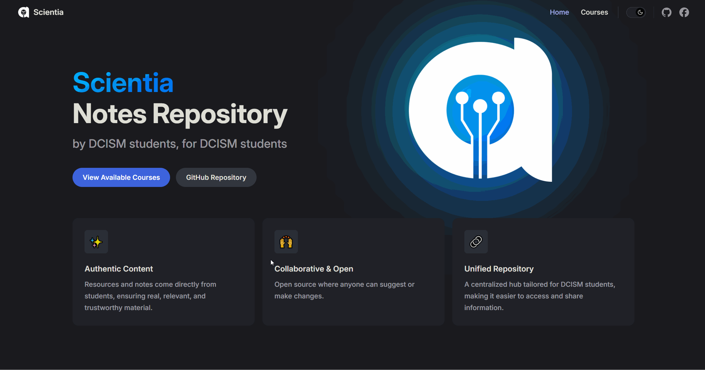

<h1 align="center">
     </img>
</h1>

  <i>A repository of notes & resources for the different courses offered in USC DCISM.</i> 
  <i>Built with <a href="https://vitepress.dev/">Vitepress</a> + <a href="https://www.typescriptlang.org/">TypeScript</a> and deployed  @ <a href="usc-cisco.github.io/scientia/">usc-cisco.github.io/scientia</a>.</i>

<h5 align="center">
  
   
   
  
  
  
  
  
  
</h5>

## Contributing

We'd love your help in improving the website with your own content & fixes. Here are some ways you can help:

- Before doing anything, read our [Code of Conduct](https://github.com/usc-cisco/scientia/blob/main/.github/CODE_OF_CONDUCT.md).
- Read our [Contributing guidelines](https://github.com/usc-cisco/scientia/blob/main/.github/CONTRIBUTING.md) for making a pull request to edit the repostiory yourself.
- [Raise issues](https://github.com/usc-cisco/scientia/issues/new/choose) to; correct wrong or misleading content, request more notes, or to fix broken links or outdated resources.
- [Fork the repository](https://github.com/usc-cisco/scientia/fork) and work on changes on your local machine.

### Resource Requests or Bug Reports

[Create an issue](https://github.com/usc-cisco/scientia/issues/new/choose) while following the specific templates.

## Credits

Thank you to all the students who contributed to this project! Your efforts will carry on through generations through this repository.

