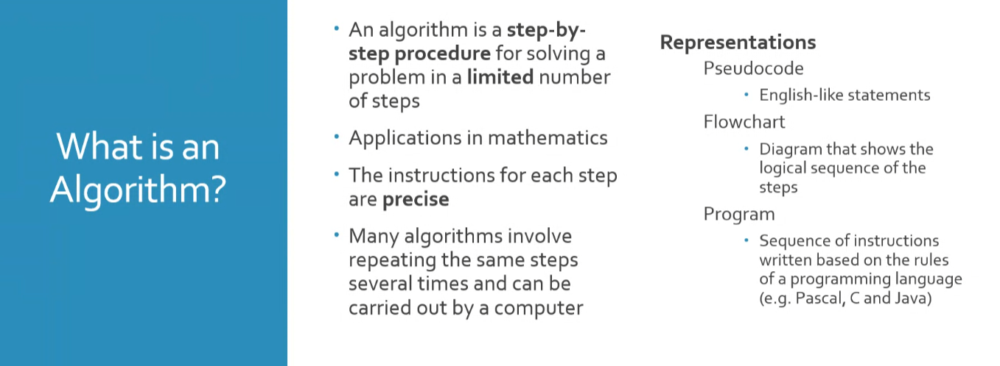
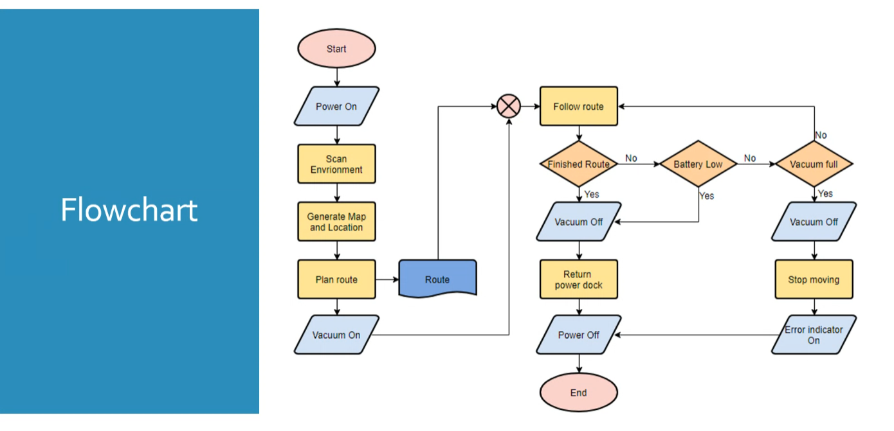

# {{ $frontmatter.title }}

[[toc]]

## Definition

> [!info] Definition
>
> - A **sequence of instructions** OR **rules** to be followed in order **to solve a problem** or do calculations.
> - Usually done by Computers.

### Flowchart

> [!info] Definition
> Connected set of shapes that represents instructions/procedures.

### Pseudocode

> [!info] Definition
> It is a step-by-step logical procedural way of programming, written in English.
>
> - It’s “fake code”.

::: details Example

:::
